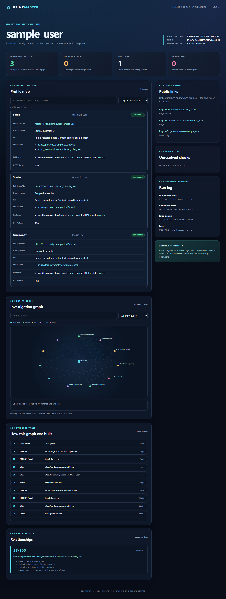

# OSINTMaster

**One target. A traceable investigation graph.**

OSINTMaster 0.3 investigates a username, email address, domain, IP address, URL, international phone number, or local image. It turns public observations into typed events, follows bounded pivots, and shows the source of each relationship in a local dashboard. Each run also has a durable local history entry, so earlier investigations can be inspected and compared. Phone numbers are currently recorded as seed entities without an automatic lookup provider. A matching username is weak evidence and **never proves that two accounts belong to the same person**.



[See the interactive graph preview](assets/graph-demo.png). Both images come from the offline synthetic demo below.

The fast built-in username scan checks seven sources: GitHub, GitLab, Codeberg, DEV Community, Hacker News, Bluesky (default `bsky.social` handles), and Telegram. Six use public APIs with exact handle checks. Telegram requires an exact public preview; a generic HTTP 200 contact page is not a match. The Reddit check was removed from the default registry after live tests found that a generic HTTP 200 page was returned for both existing and randomly generated usernames. The opt-in `--wide` catalogue adds 139 public site rules, each of which passed one positive and one fresh negative canary on 2026-10-01. These wider matches are `PROBABLE` until manually reviewed. Rules can degrade as sites change. Run `osintmaster sites --wide` to see the 146-source catalogue.

## Installation

Requires Python 3.10 or newer. Install the 0.3 development version from this checkout; a PyPI release has not been made.

```bash
python -m pip install -e .
osintmaster --help
```

After this branch is published, `pipx install git+https://github.com/Larslllllll/osintmaster.git` or `uv tool install git+https://github.com/Larslllllll/osintmaster.git` can provide an isolated CLI installation.

## One-command investigation

```bash
osintmaster hunt {yourusername} --depth 2 --open
osintmaster hunt {yourusername} --wide --max-requests 150
osintmaster dashboard {yourusername}
osintmaster web
```

Replace `{yourusername}` with the handle to investigate. `dashboard` opens a local server on `127.0.0.1`; press Ctrl+C to stop it. Its Review page lets an analyst mark hypothetical graph links as supported, rejected or needing review and save a short note. Those decisions live in the local SQLite database, separate from the immutable scan snapshot. The standalone HTML file is read-only. Every hunt writes `report.json`, `graph.json`, `events.jsonl`, and a standalone interactive `report.html` to the local report directory. It also saves a snapshot in `investigations.sqlite3` under the report root. The database is local.

`web` opens a local workspace where you can start a single-target hunt or a case with up to 20 targets, watch its job status, and browse saved reports. It runs one job at a time using the same bounded hunt engine and keeps completed results in the local report root. Keep the server open until a running job finishes. The workspace is for one user on the same computer; it does not provide remote accounts or access control.

The pivot depth controls follow-up work: depth 0 checks the starting target, depth 1 follows direct public links to known profile sites, and depth 2 can resolve domains found through those links. The graph still records discovered leads beyond the chosen depth. Cycles and repeated provider checks are deduplicated. Built-in HTTP and DNS operations share a request budget; `--max-events`, `--max-requests`, `--max-runtime`, and `--max-per-provider` cap the hunt.

```bash
osintmaster hunt example.org --depth 1
osintmaster hunt researcher@example.org --depth 1
osintmaster hunt https://github.com/octocat --depth 1
osintmaster hunt +41791234567 --depth 0
osintmaster hunt photo.jpg --depth 0
osintmaster case research alice example.org --depth 1
```

Each run prints an investigation ID. Inspect old runs even after a new scan replaces the latest report files:

`case NAME TARGET1 TARGET2 [TARGET3 ...]` accepts 2–20 distinct seeds, detects each target type, and investigates them together under one request budget. The resulting `case-NAME` report records all seeds in the graph. Use a short name made of letters, numbers, dots, underscores or hyphens. Case reports are saved and compared like single-target hunts.

```bash
osintmaster investigations
osintmaster investigations --target {yourusername}
osintmaster show RUN_ID
osintmaster diff OLD_RUN_ID NEW_RUN_ID
```

`diff` shows newly observed entities, profile status changes, and observations missing from the later run. Missing observations do **not** prove account deletion; rate limits and partial runs are reported separately. Add `--json` to these commands for machine-readable output.

Use `--type username` if a handle such as `name.example` would otherwise be interpreted as a domain. URL pivots follow only recognized public profile URLs; arbitrary websites are recorded as leads and their hostnames can be resolved, but they are not crawled.

## Focused commands

```bash
osintmaster username {yourusername}
osintmaster username {yourusername} --variants --json
osintmaster username {yourusername} --wide
osintmaster username {yourusername} --timeout 10 --max-concurrency 5 --no-external
osintmaster dorks {yourusername}
osintmaster metadata image.jpg
osintmaster image image.jpg
osintmaster image compare avatar1.jpg avatar2.jpg
osintmaster doctor
osintmaster plugins
osintmaster sites
osintmaster health canaries.json --save health-result.json
osintmaster health-catalog --start 0 --limit 20 --save catalog-health.json
osintmaster investigations
osintmaster dashboard --run RUN_ID
osintmaster web --no-open --port 8080
osintmaster report {yourusername}
```

`username` writes `report.json` and `report.html` under the configured report root, in a directory named after the target. Use `--output reports/` to choose another root. `--json` prints pure JSON on stdout, including when provider failures occur. A command may exit with code 3 for a partial scan while still producing a report. `--html` prints the HTML path when used with `--quiet`.

Generated variants are scanned only with `--variants`. They are candidates, not assertions about one person. Search dorks are printed for manual use; OSINTMaster does not scrape search engines.
The original spelling is retained for case-sensitive Hacker News IDs. Mixed-case username reports use a short hash suffix in their local directory name so they do not overwrite lowercase reports on case-insensitive filesystems.

### Check provider health

Create `canaries.json` with public handles you control and a deliberately unregistered test handle:

```json
{
  "cases": [
    {"site": "GitHub", "username": "your-controlled-public-handle", "expected": "CONFIRMED"},
    {"site": "GitHub", "username": "your-unregistered-test-handle", "expected": "NOT_FOUND"}
  ]
}
```

Replace both example handles before running `osintmaster health canaries.json --save health-result.json`. The command contacts only the named built-in sources and records UTC time, actual status, HTTP status and duration. It reports `PASS` for an exact match, `FAIL` for a contrary definitive result, and `INCONCLUSIVE` for blocked access, rate limits, network errors or ambiguous pages. Exit code 3 means at least one failure or inconclusive case; `--json` prints the same dated result for automation. A health result applies only to the supplied cases and time. Telegram's generic contact page cannot prove absence, so a Telegram `NOT_FOUND` canary may remain inconclusive. Keep fixtures containing personal test accounts outside the repository.

`health-catalog` rechecks a slice of the 139 extended rules using the upstream public positive control and a freshly generated missing handle. It assigns dated `HEALTHY`, `BLOCKED`, `BROKEN` or `DEGRADED` outcomes and exits with code 3 if any rule does not pass both controls. Split larger rechecks into slices with `--start` and `--limit` to avoid unnecessary request bursts. Some rules use a verified HTTP 404 as the missing-account condition when an upstream negative text marker has drifted. A passing pair does not prove that every username result from that site is correct.

## Features and architecture

- A packaged JSON registry describes public API endpoints or profile URLs and conservative detection rules.
- The `hunt` engine dispatches typed events to bounded providers and exports a graph with UUID entities, typed relations, separate observations and evidence, provider runs, and suggested pivots. Canonical keys deduplicate entities while preserving aliases and source values.
- Event providers declare accepted and produced types, cost and activity. Default hunts run only free, local or passive providers. The provider HTTP context shares the request budget and rejects private IP endpoints.
- SQLite stores full run snapshots alongside indexed events, entities, relationships, observations, evidence, findings, and provider runs. JSONL provides a simple automation stream.
- The offline HTML report has interactive status filters, search, profile evidence, a clickable graph, an evidence trail and a provider activity log. The same report can be served locally with `dashboard`.
- The local dashboard can browse saved runs for one target, compare adjacent runs with a readable change view and JSON, open an older investigation by ID with `dashboard --run ID`, and save analyst decisions on scored graph hypotheses. The local workspace can launch hunts and cases in the browser. Write forms require a local origin and a per-server token.
- `asyncio` and `httpx` bound global and per-host concurrency, space same-host requests, apply timeouts and retry failures at most twice.
- Built-in providers return typed findings. External tools and third-party entry points use provider interfaces in `osintmaster.providers.base` and `osintmaster.plugins.base`.
- Opt-in provider canaries compare live results against controlled positive and negative references without turning ambiguous responses into passing tests.
- Pairwise correlation records positive and contradictory public claims: usernames, display names, biographies, public links, image URLs, optional plugin-supplied image hashes and locations. It discounts unverified profile pages, caps related handle/name evidence, and reports only pairs with at least 30 support points; matching handles alone remain weak. Scores are heuristic support on a 0–100 scale, not identity probabilities. Image URL equality does **not** mean that image content was checked.
- Local image analysis computes SHA-256, average hash, difference hash and a DCT perceptual hash, and compares shared EXIF tags. It performs no face recognition.
- Metadata analysis reads EXIF and XMP when Pillow supports the image; ExifTool is an optional richer source. GPS data is labelled and no geolocation lookup occurs.
- Reports are standalone JSON and HTML with escaped page content and no tracking resources.

The [architecture guide](docs/architecture.md) explains event provenance, graph edges, provider contracts, pivot depth and resource limits. Built-in integrations follow public documentation for [GitHub](https://docs.github.com/en/rest/users/users#get-a-user), [GitLab](https://docs.gitlab.com/api/users/), [Codeberg](https://codeberg.org/api/swagger), [DEV](https://developers.forem.com/api/v0), [Hacker News](https://github.com/HackerNews/API), [Bluesky](https://docs.bsky.app/docs/api/app-bsky-actor-get-profile), and [Telegram public username links](https://core.telegram.org/api/links). Providers can degrade or block automated clients, so every result retains its source and status.

The [roadmap and release gates](docs/roadmap.md) track which planned stages have passed their acceptance checks and which still need work.

### Offline demo

```bash
python examples/demo.py
osintmaster dashboard sample_user --output examples/demo-output
```

The demo uses a mocked HTTP transport and synthetic `example.test` profiles. It makes no network requests. The generated report can also be opened directly as `examples/demo-output/sample_user/report.html`.

### Optional tools

Sherlock and Maigret are never required. To enable an installed tool, set its flag in your local configuration (example below). The adapters now use each tool's default site catalogue, retain at most 500 candidates per tool, and apply an overall subprocess timeout. Their matches remain `POSSIBLE` until independently reviewed; broad external coverage is not a claim that hundreds of sites have passed OSINTMaster canaries. Reddit remains excluded after a random nonexistent username produced a false lead in a live Sherlock run. Their command-line output formats may change across tool versions. See the [Sherlock CLI](https://github.com/sherlock-project/sherlock) and [Maigret usage](https://github.com/soxoj/maigret/blob/main/docs/source/usage-examples.rst) for their current catalogues.

```toml
[providers]
sherlock = true
maigret = true
```

`--no-external` disables both for a scan. `doctor` checks for installed executables; it never installs them. An enabled but missing external tool produces an explicit partial-scan error. Malformed Maigret records are reported alongside any usable findings. ExifTool is used for metadata when present and can be disabled with `--no-exiftool`.

### Configuration

The file is `config.toml` in the platform-specific user configuration directory (`%APPDATA%\osintmaster` on Windows, `~/.config/osintmaster` on Linux and the platformdirs Application Support location on macOS). `osintmaster doctor` prints the exact path. An example is in [`examples/config.toml`](examples/config.toml). Relative `reports_dir` values resolve from the configuration directory. `OSINTMASTER_TIMEOUT` overrides the configured timeout.

Secrets must stay outside this repository. No API key is needed for the built-in scan. To use the optional Brave Search API, set `OSINTMASTER_BRAVE_API_KEY` in your environment and run `osintmaster dorks QUERY --search`. This makes one API request and prints up to ten results; API usage may incur charges. Search API providers can also be supplied by plugins; they should read credentials from environment variables or a secure user configuration source and must not include them in findings, logs or reports. Enabled search plugins are each called once with the original query and print up to 20 results. Search results are not saved.

### Plugin development

Install a separate distribution that declares an entry point in the `osintmaster.plugins` group:

```toml
[project.entry-points."osintmaster.plugins"]
my_provider = "my_package.plugin:Provider"
```

Implement `UsernameProvider` or `SearchProvider` from `osintmaster.providers.base`, or an event provider following `osintmaster.investigation.providers.EventProvider`. Entry points are discoverable with `osintmaster plugins` and run only when named in the user configuration:

```toml
[plugins]
enabled = ["my_provider"]
```

Username plugins receive the shared `httpx.AsyncClient` and must return a `Finding`. They should expose a `host` string for per-host spacing. Search plugins return `SearchResult` objects and manage their own API credentials and request limits. Event plugins declare `accepts`, `produces`, `cost` and `activity`, and implement asynchronous `run(event, context)`. `hunt` and `case` load enabled event plugins; they dispatch only free local or passive providers by default. Use `context.get(https_url)` for the shared request budget and bounded responses. Plugin failures are isolated and reported. Only install plugins you trust; Python entry points execute code from their package and can make network requests outside the provided context.

## Responsible use and privacy

Use only public information, local files you are entitled to examine, official APIs, and data sources you are authorized to use. Respect platform terms and rate limits. Do not use this tool to bypass login walls, captchas or access controls, or to infer identity from a score alone. The tool has no telemetry and makes network requests only for an explicit scan/hunt, `health-catalog`, `dorks --search` or `doctor` internet check. The `dashboard` server binds to loopback and serves one saved report; review decisions are stored locally. Reports can contain personal information; store and share them carefully. The default report root is outside the repository in the platform-specific user data directory.

## Development

```bash
python -m pip install -e ".[dev]"
ruff check .
ruff format --check .
mypy src/osintmaster
pytest
python -m build
python -m twine check dist/*
```

The test suite uses mocked HTTP responses and does not contact profile sites. CI runs tests on Linux and Windows with Python 3.10–3.14, then checks lint, types and distributions. Release publishing is configured for PyPI Trusted Publishing on a GitHub Release tagged with the package version, such as `v0.3.0`. Register `.github/workflows/publish.yml` as the trusted workflow on PyPI and select GitHub environment `pypi`. No permanent upload token is stored in the repository.

## Exit codes

| Code | Meaning |
| --- | --- |
| 0 | Successful command |
| 1 | General or report I/O error |
| 2 | Invalid input or configuration |
| 3 | Partial scan or hunt, or a failed or inconclusive health check |

## Contributing, security and license

See [CONTRIBUTING.md](CONTRIBUTING.md) for development and site-registry contributions and [SECURITY.md](SECURITY.md) for private vulnerability reporting guidance. Application code and the original seven-site registry are under [MIT](LICENSE). The adapted extended catalogue is under [CC BY-SA 4.0 with source attribution and change notes](DATA_LICENSE.md).
