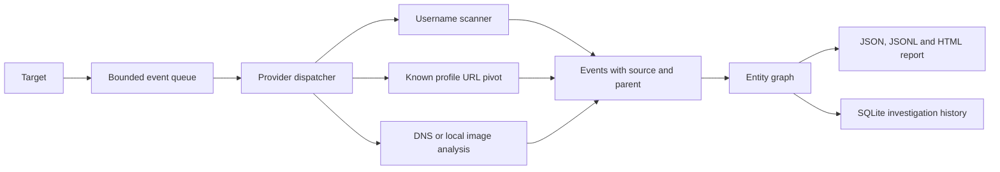

# Investigation engine (0.3)

OSINTMaster separates **entities**, **observations**, and **evidence**. An event is the hunt engine's dispatch message. Each event is recorded as an observation of an entity, with evidence that identifies the source and collection method. Negative provider checks are observations too; they do not create a profile entity. The graph also records provider executions and pivot recommendations.

## Data model

- `Event`: type, value, source provider, source URL, parent event ID, confidence, depth, timestamp, tags and evidence.
- `Entity`: a per-run UUID, type, display value, canonical value, aliases, attributes, first/last seen time and observation count. An entity's legacy `confidence` field describes observation strength, not identity probability.
- `Observation`: entity, property, value, state, provider, observation time, evidence IDs and provider-run ID. Historical observations are appended rather than replaced.
- `EvidenceRecord`: source URL, provider, method, collection time and a bounded excerpt or reference. Full HTTP responses are not embedded in the graph.
- `Relation`: UUID, typed directed endpoints, source, evidence IDs, strength and optional heuristic score with supporting and contradictory features. `POSSIBLY_SAME_AS` is explicitly hypothetical.
- `ProviderRun`: input entity, start/end time, status, request count, output counts, errors and rate-limit messages.
- `PivotCandidate`: entity, discovery parent, expected information gain, cost, priority and processing status. Priority is a simple gain/cost heuristic, not a measured probability.
- `Report`: findings, correlations, events, graph, provider runs, errors, rate limits, limits and a unique investigation ID.

An event is deduplicated by type, value, provider and parent. Entities are deduplicated within a run by type, canonical value and optional username platform scope. Email local-part case and Hacker News username case are preserved; domains use IDNA and lowercase; URL host/default port/fragment are normalized; IP addresses use `ipaddress`; phone seeds require international E.164 form. HTTP and HTTPS URLs remain distinct because they can return different content. Relations are deduplicated by endpoints, type, provider and source URL. The exported `graph.json` retains `nodes` and `edges` for existing clients and adds `observations`, `evidence`, `provider_runs` and `pivot_candidates`.

`events.jsonl` uses a `record` discriminator (`investigation`, `event`, `entity`, `relationship`, `observation`, `evidence`, `pivot_candidate`, `graph_provider_run`, `finding`, `provider_run`) so downstream tools can stream it line by line. Each run has a UUID-based `investigation_id` that remains stable across its four exported files and its SQLite snapshot.

Relationship names describe the **source of a claim**, not verified ownership. `LINKS_TO` means a matched profile published a URL. `CLAIMS_NAME` means a public profile supplied a name. `RESOLVES_TO` is a DNS observation at scan time. A `POSSIBLY_SAME_AS` edge stores a heuristic evidence score and any contradictions; it is never a calibrated identity probability.

## Pivot behavior

The starting username is checked against the built-in registry. Confirmed profiles can emit public display names, location claims, published links and email addresses explicitly present in their public bio. Possible pages remain candidate profile nodes and do not trigger automatic pivots. `case NAME TARGET...` places 2–20 typed seeds in one investigation, so they share event, provider and request limits and appear as separate seed entities in the same graph.

At depth 1, links matching a known profile URL can be checked on that specific site. Other HTTP(S) links produce a domain event. At depth 2, public domains can be resolved to IP addresses. An email target emits its domain. A public IP target can receive reverse DNS. A local image target emits its hash and basic dimensions. Arbitrary websites are **not** fetched or crawled by the pivot engine.

The engine tracks each `(provider, username)` check. A profile linking back to one already checked does not trigger another request. `--depth 0` records direct observations, `--depth 1` processes direct pivots, and `--depth 2` processes another level. Values discovered beyond the limit remain in the graph but are not investigated further.

## Resource limits

`HuntLimits` validates and enforces maximum depth, event count, built-in request count, runtime and checks per provider. The built-in username scanner and DNS lookups share one request budget. The scanner retains its per-host spacing, concurrency bound, per-request timeout and retry cap. A stopped or partial run still produces a report with the reason in `errors`.

The limits apply to the built-in hunt path and to event-plugin requests that use `ProviderContext.get`. The `username` command retains its optional external tools and plugin behavior. Trusted third-party event plugins named in local configuration can run in `hunt` and `case`; their direct networking outside the context cannot be counted against the budget.

Built-in profile requests do not follow HTTP redirects. A redirect is reported as unresolved instead of fetching a new host. Published outbound links are recorded as claims; only URLs matching a registered profile template can trigger a follow-up check.

## Event provider contract

The `ProviderRegistry` dispatches each event to providers whose declared `accepts` set contains its type. Each provider declares a `produces` set, a cost category (`FREE_OFFLINE`, `FREE_PUBLIC`, `FREE_API`, `FREE_TIER`, `PAID`) and an activity category (`LOCAL`, `PASSIVE`, `ACTIVE`). Default hunts dispatch only the three free cost categories and local/passive activity. An undeclared event type, invalid confidence or negative pivot depth becomes a provider error instead of corrupting the graph.

An event provider implements `run(event, context) -> list[Observation]`. Use `context.get(https_url)` for HTTP: it shares the hard request budget and deadline, does not follow redirects, rejects private IP endpoints, and caps the response at 1 MB. A returned `Observation` includes a type, value, edge relationship, confidence, source URL and optional evidence. Custom providers can be registered programmatically via `HuntEngine(..., event_providers=[...])`. This Python contract is for trusted installed code; direct networking outside `context` cannot be counted against the budget.

The existing `username` CLI and its plugin interface remain compatible. `hunt` and `case` load enabled entry-point event plugins alongside built-in providers. The built-in username scanner uses the packaged site registry and its conservative site-specific API or preview rules. Telegram requires an exact public preview; a generic `Contact @handle` page stays unresolved even though it returns HTTP 200. Public previews may identify a user, group or channel. These are Telegram account types, not assertions about a person.

`osintmaster health FIXTURE.json` is an explicit live canary runner for built-in username providers. A fixture names each source, handle and expected `CONFIRMED`, `PROBABLE` or `NOT_FOUND` result. It uses the normal scanner, runs cases serially, and records the actual status, HTTP status, duration and UTC timestamp. An exact result passes; a definitive contradiction fails; `UNKNOWN`, `BLOCKED`, errors and rate limits stay inconclusive. Only supplied cases are covered. Results can be saved with `--save` and compared over time outside the repository. The opt-in `--wide` catalogue has 139 adapted WhatsMyName rules which passed one positive and one random negative canary on 2026-10-01. Some negative rules rely on a separately checked HTTP 404 when the upstream body marker drifted. `health-catalog` repeats this check in bounded slices. Extended matches are `PROBABLE`, and a dated pass is not a permanent guarantee. The catalogue is CC BY-SA 4.0; see `DATA_LICENSE.md`.

## Local history and comparison

Every CLI hunt saves a SQLite snapshot at `<report-root>/investigations.sqlite3`. A transaction writes the full report plus queryable `events`, `entities`, `relationships`, `findings`, `provider_runs`, `graph_observations`, `graph_evidence`, `graph_pivot_candidates` and graph detail tables. Existing version 1 or 2 databases gain the new tables on the next save or review; earlier snapshots remain readable. Analyst decisions on hypothetical relations are kept in `relation_reviews`, separate from the scan snapshot. `osintmaster investigations` lists runs, `show ID` retrieves any full snapshot, and `diff OLD NEW` compares runs of the same target and type. Run IDs accept a unique prefix of at least eight hexadecimal characters.

Diffs report newly observed entities, changed profile statuses and items not observed in the later run. They deliberately do not call a missing profile "removed": a provider can be rate limited, skipped by a request budget or changed by a remote service. The diff flags partial runs when either report has errors or rate limits. The latest per-target `report.json` and HTML are convenience files; SQLite retains earlier runs.

`dashboard TARGET` serves the latest report on loopback. When the SQLite store exists, its History link lists up to 100 saved runs for the same target and target type. Adjacent runs have a comparison link showing status changes, newly observed items and items not observed in the later run; the same diff is available as JSON. `dashboard --run ID` opens a particular saved snapshot. The Review page supports local decisions and notes on scored hypothetical links, with a per-server form token, local Origin check and bounded input. The local server checks the Host header and refuses run, review or comparison URLs belonging to another target or target type; a standalone exported HTML report contains no live History or Review link.

`web` serves a single-user workspace on loopback. A form can start one hunt or a named multi-seed case and enforces the normal hunt limits. One background job can run at a time. Status pages refresh until completion and link to saved reports; the workspace lists up to 100 recent runs from the same local SQLite store. The server checks Host and Origin, requires a per-server form token, and bounds form size. It has no remote authentication or multi-user isolation and should not be exposed outside localhost.

## Correlation

Correlation uses separate evidence categories for handle, display name, biography, public link, image URL/hash and location. It discounts positive evidence from `POSSIBLE` pages, caps the combined handle/display-name contribution at 18 points, and records conflicting multi-part names or locations as negative evidence. Pairs under 30 points are omitted from reports and graph hypotheses, so broad catalogues do not generate thousands of same-handle-only links. The score is a bounded support indicator, not a calibrated identity probability. The HTML dashboard displays source URLs and individual evidence for manual review.

## Extension points

The existing `UsernameProvider` and `SearchProvider` interfaces remain available alongside the new `EventProvider` contract. The current pivot engine deliberately restricts URL follow-ups to registered profile templates; widening that scope requires URL validation, private-network protection and a separately reviewed request policy.
